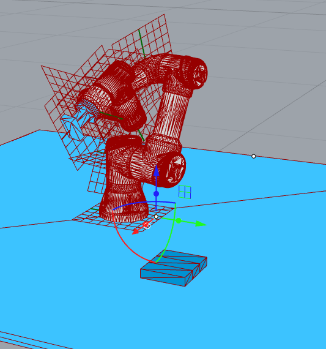

# Assignment 04

* Create a simple assembly tweaking the functions of example `530`.
* Ensure all parts are independently buildable (ie. there are trajectories for all).

## How to start

* Copy example `530_pick_and_place_assembly.py` into your assignment folder.
* Use the file `531_viewer.ghx` in `lecture_07` for visual inspection of the solution.
* Tweak the values of the functions that define the assembly to create a new assembly with at least 20 parts.
* After defining a new parametric assembly, run the code to ensure all parts are solvable.
* Commit both the Python file (`530_pick_and_place_assembly.py`) and the JSON file (`530_pick_and_place_assembly.json`).

## Expected result

## How to submit your assignment

> NOTE: The command line instructions for git can be replaced by visual clients such as Github Desktop or VS Code git integration, there are here only as guidance.

1. You should have forked this repository last week, if not, check [assignment submission instructions in lecture 02](../../lecture_02/assignment_01#how-to-submit-your-assignment).
2. Make sure your local clone is up to date

       (fs2022) git checkout main
       (fs2022) git pull origin

3. Use a branch called `assignment-04` for this week's assignment

       (fs2022) git checkout -b assignment-04
       (fs2022) git push -u assignments assignment-04

4. Create a folder with your name and last name, eg. `david_bowie` (make sure it is inside the current assignment folder)
5. Copy example 530 into the folder created above and use it as starting point code.
6. For visual inspection, use the file `531_viewer.ghx` in `lecture_07` and select your JSON file.
6. Solve the coding assignment and commit both the Python file (`530_pick_and_place_assembly.py`) and the JSON file (`530_pick_and_place_assembly.json`)
    

<small>(How do I commit?)</small>

    

    Usually, commits are done from a visual client or VS code,
    but you can also commit your changes from the command line:

       (fs2022) git add lecture_07/assignment_04/david_bowie/\* && git commit -m "hello world"

    
    

    

8. Once you're ready to submit, push the changes:

       (fs2022) git push assignments

9. And create a pull request (<small>[What's a pull request?](https://docs.github.com/en/github/collaborating-with-issues-and-pull-requests/about-pull-requests)</small>)

    1. Open your browser and go to your fork
    2. Create the pull request clicking `Compare & pull request` and follow the instructions

    
